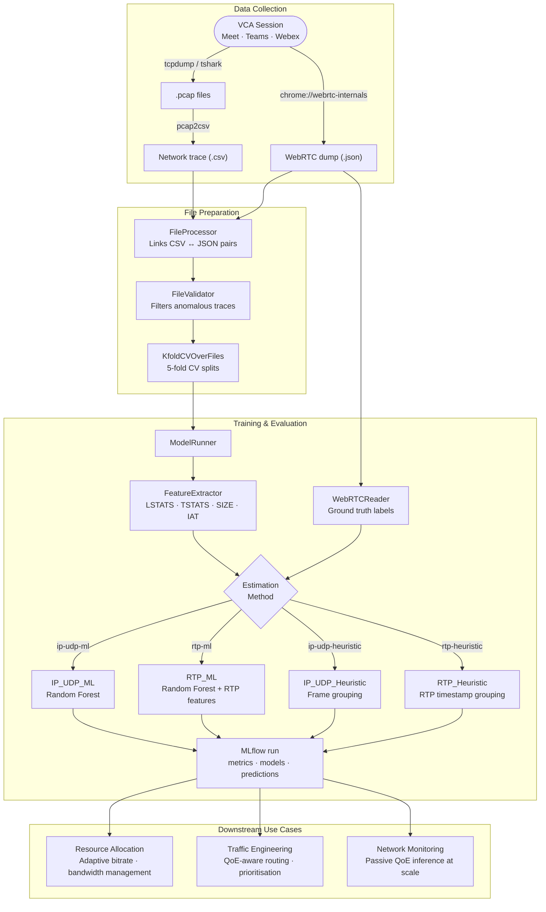

vcaml
==============================

An end-to-end pipeline for estimating QoE metrics (frames/sec, bitrate, jitter, resolution) for WebRTC-based video conferencing without using application-layer headers. Published at [IMC 2023](https://doi.org/10.1145/3618257.3624828).

## Architecture



## Supported Configurations

### Metrics

| Metric | Description | Unit | Heuristic | ML |
|---|---|---|---|---|
| `framesReceivedPerSecond` | Inbound video frame rate | frames/sec | ✓ | ✓ |
| `bitrate` | Inbound video bitrate | bits/sec | ✓ | ✓ |
| `frame_jitter` | Inter-frame delay standard deviation | ms | ✓ | ✓ |
| `frameHeight` | Inbound video resolution height | px | — | ✓ |

FPS metrics use ±2 frames/sec tolerance accuracy in addition to MAE. `frameHeight` uses classification accuracy.

### Estimation Methods

| Method | Uses RTP headers | `frameHeight` | Description |
|---|---|---|---|
| `ip-udp-ml` | No | ✓ | Random Forest over IP/UDP packet features |
| `rtp-ml` | Yes | ✓ | Random Forest over IP/UDP + RTP-specific features |
| `ip-udp-heuristic` | No | — | Groups packets into frames by size similarity |
| `rtp-heuristic` | Yes | — | Groups packets into frames by RTP timestamp |

### Feature Subsets (ML methods)

| Subset | Description |
|---|---|
| `LSTATS` | Packet length statistics per window: mean, std, min, max, Q1/Q2/Q3, count, total bytes, unique sizes |
| `TSTATS` | Inter-arrival time statistics per window: mean, std, min, max, Q1/Q2/Q3, burst count |
| `SIZE` | Raw per-packet sizes padded/truncated to a fixed-length vector |
| `IAT` | Raw inter-arrival times padded/truncated to a fixed-length vector |

`rtp-ml` additionally extracts RTP-specific features per window: buffer time statistics, unique RTP timestamps, out-of-order sequence number count, RTP lag statistics.

### Supported Platforms and Datasets

| VCA | In-lab | Real-world |
|---|---|---|
| Google Meet | ✓ | ✓ |
| Microsoft Teams | ✓ | ✓ |
| Webex | ✓ | ✓ |

## Prerequisites

| Tool | Purpose | Install |
|---|---|---|
| [`uv`](https://docs.astral.sh/uv/) | Python dependency management | `curl -LsSf https://astral.sh/uv/install.sh \| sh` |
| [`tshark`](https://www.wireshark.org/docs/man-pages/tshark.html) | PCAP → CSV conversion | `brew install wireshark` (macOS) · `apt install tshark` (Debian/Ubuntu) |

`tshark` must be on `PATH` before running `pcap2csv`. If you are working from pre-converted CSVs, `tshark` is not required.

## 1. Download Datasets

- [In-Lab](https://drive.google.com/file/d/1XmFqwCKzdJtYg7TQHS8gCvA5CeI_499P/view?usp=sharing)
- [Real World](https://drive.google.com/file/d/1kASPQlokHiUlhWry6I8qM-Hc0AvHz5eq/view?usp=sharing)

Unzip and place each dataset under `data/`:

```
data/
├── in_lab_data/
└── real_world_data/
```

## 2. Install Dependencies

```bash
make install   # or: uv sync
```

> PCAP → CSV conversion requires `tshark` to be on PATH. See `src/vcaml/io/pcap2csv.py`.
> For data collection dependencies, see [src/data_collection/real-world/README.md](src/data_collection/real-world/README.md).

## 3. Configure

Edit `config.yaml` in the project root to adjust RTP payload types, feature vector sizes, or default training parameters:

```yaml
training:
  metrics: [framesReceivedPerSecond, bitrate, frame_jitter, frameHeight]
  estimation_methods: [ip-udp-heuristic, rtp-heuristic, ip-udp-ml, rtp-ml]
  feature_subsets: [[LSTATS, TSTATS]]
  k_folds: 5
```

## 4. Train and Evaluate Models

```bash
# In-lab dataset (default)
make train

# Real-world dataset
make train-rw

# Custom dataset path
make train DATASET=data/my_dataset

# Restrict to specific metrics or methods
make train ARGS='--metrics framesReceivedPerSecond --methods ip-udp-ml rtp-ml'
```

Progress and per-experiment results (MAE, accuracy) are printed to the terminal. All runs — parameters, per-fold metrics, model pickles, and per-VCA predictions — are logged to MLflow under `mlruns/`. Launch the UI with:

```bash
uv run mlflow ui   # then open http://localhost:5000
```

## 5. Analyze Results

Open and run the notebooks in `notebooks/` (`In_Lab_Analysis`, `Real_World_Analysis`, `Sensitivity_Analysis`). Each notebook reads results from the local MLflow store (`mlruns/`) via `vcaml.io.mlflow_loader`.

> **Pre-trained results** are available as legacy pickle archives (pre-MLflow format) — [In-lab](https://drive.google.com/file/d/1w5zR-jAxcUNBAk23Q_YcuC5loOT2Ijr9/view?usp=sharing) · [Real-world](https://drive.google.com/file/d/1vnLC1Sw-v_ARnf9rePOqUcOR15DjNTgA/view?usp=sharing). These require importing into MLflow before the notebooks can load them.

## 6. Collect Additional Data

Refer to [In-Lab Data Collection](src/data_collection/in-lab) and [Real-World Data Collection](src/data_collection/real-world) for more details.

## 7. Cite

```bibtex
@inproceedings{10.1145/3618257.3624828,
    author = {Sharma, Taveesh and Mangla, Tarun and Gupta, Arpit and Jiang, Junchen and Feamster, Nick},
    title = {Estimating WebRTC Video QoE Metrics Without Using Application Headers},
    year = {2023},
    publisher = {Association for Computing Machinery},
    doi = {10.1145/3618257.3624828},
    booktitle = {Proceedings of the 2023 ACM Internet Measurement Conference},
    series = {IMC '23}
}
```
