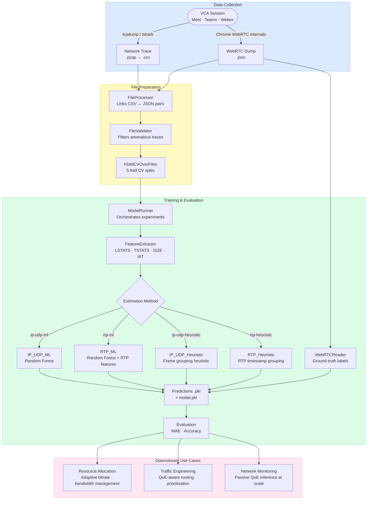

vcaml
==============================

An end-to-end pipeline for estimating QoE metrics (frames/sec, bitrate, jitter, resolution) for WebRTC-based video conferencing without using application-layer headers. Published at [IMC 2023](https://doi.org/10.1145/3618257.3624828).

## Architecture



## 1. Download Datasets

- [In-Lab](https://drive.google.com/file/d/1XmFqwCKzdJtYg7TQHS8gCvA5CeI_499P/view?usp=sharing)
- [Real World](https://drive.google.com/file/d/1kASPQlokHiUlhWry6I8qM-Hc0AvHz5eq/view?usp=sharing)

Unzip and place each dataset under `data/`:

```
data/
├── in_lab_data/
└── real_world_data/
```

## 2. Install Dependencies

```bash
uv sync
```

> PCAP → CSV conversion requires `tshark` to be on PATH. See `src/util/pcap2csv.py`.
> For data collection dependencies, see [src/data_collection/real-world/README.md](src/data_collection/real-world/README.md).

## 3. Configure

Edit `config.yaml` in the project root to adjust RTP payload types, feature vector sizes, or default training parameters:

```yaml
training:
  metrics: [framesReceivedPerSecond, bitrate, frame_jitter, frameHeight]
  estimation_methods: [ip-udp-heuristic, rtp-heuristic, ip-udp-ml, rtp-ml]
  feature_subsets: [[LSTATS, TSTATS]]
  k_folds: 5
```

## 4. Train and Evaluate Models

```bash
# In-lab dataset (default)
make train

# Real-world dataset
make train-rw

# Custom dataset path
make train DATASET=data/my_dataset

# Restrict to specific metrics or methods
make train ARGS='--metrics framesReceivedPerSecond --methods ip-udp-ml rtp-ml'
```

Progress and per-experiment results (MAE, accuracy) are printed to the terminal. Intermediate outputs (model pickles, per-VCA predictions) are written to `data/<dataset>_intermediates/`.

## 5. Analyze Results

Open and run the notebooks in `notebooks/` (`In_Lab_Analysis`, `Real_World_Analysis`, `Sensitivity_Analysis`). Pre-trained model intermediates are also available:

- [In-lab Model Intermediates](https://drive.google.com/file/d/1w5zR-jAxcUNBAk23Q_YcuC5loOT2Ijr9/view?usp=sharing)
- [Real-world Model Intermediates](https://drive.google.com/file/d/1vnLC1Sw-v_ARnf9rePOqUcOR15DjNTgA/view?usp=sharing)

Unzip and place them under `data/` alongside the raw datasets.

## 6. Collect Additional Data

Refer to [In-Lab Data Collection](src/data_collection/in-lab) and [Real-World Data Collection](src/data_collection/real-world) for more details.

## 7. Cite

```bibtex
@inproceedings{10.1145/3618257.3624828,
    author = {Sharma, Taveesh and Mangla, Tarun and Gupta, Arpit and Jiang, Junchen and Feamster, Nick},
    title = {Estimating WebRTC Video QoE Metrics Without Using Application Headers},
    year = {2023},
    publisher = {Association for Computing Machinery},
    doi = {10.1145/3618257.3624828},
    booktitle = {Proceedings of the 2023 ACM Internet Measurement Conference},
    series = {IMC '23}
}
```
